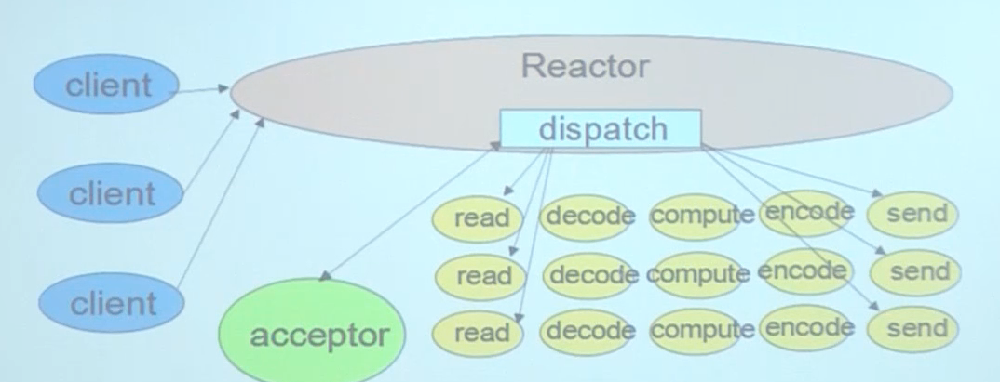

# 基础

## 通用规范

1. **命名规范**

   - **包名**
     - *advice*：出_test包外，包名不能包含下划线、应该全部大写或全部小写。


   - **变量名**
     - *advice*：类型为time.Duration 时，变量名不应该以时间单位作为后缀。

     - *warning*：名称中包含专用词【IP】时，应全部大写或小写。

     - *warning*：recevier 的名字不能是下划线。

     - *warning*：recevier name 应该反映出功能、角色，不应该使用 this 或 self。

     - *warning*：recevier name 命名应该保持一致。

     - **error**：error类型的变量名应该以 err 或者 Err 开头。


   - **结构体命名**
     - *warning*：结构体中不能包含仅大小写不同的名称定义。


   - **函数名**
     - *advice*：不能出现含仅大小写不同的名称定义。

2. **注释规范**

   - **包注释**
     - *advice*：package声明都应该有对应的包说明性注释，一个包内有一个文件有即可。

     - *advice*：应该以 Package开头，后面跟注释。

     - *warning*：// 后不要加空格或tab。

     - **error**：包注释和包声明之间不能有空行。


   - **类型注释**
     - *advice*：可导出类型的注释应该以 type name 开头。

     - *warning*：可导出类型应该包含注释。


   - **变量注释**
     - *warning*：可导出变量应该包含注释。

     - *warning*：可导出变量应该单独定义。


   - **结构体注释**
     - *warning*：可导出结构体的注释应该以变量名开头。


   - **函数注释**
     - *advice*：可导出函数应该包含注释。
     - *advice*：可导出函数的注释应该以函数名开头。

3. **可维护性规范**

   - **代码复杂度**
     - *advice*：函数**圈复杂度**不应该大于15。

     - *warning*：代码锁紧深度 <= 5。


   - **参数与返回值**
     - *warning*：返回值小于等于3个，大于三个时必须通过 struct 传递。

     - *warning*：参数不建议超过3个，大于三个时建议通过 struct 传递。


   - **程序规模**
     - *advice*：每行代码不超过100字符。
     - *advice*：每行注释不超过100字符。
     - *advice*：函数不超过100行。
     - *advice*：文件不超过2000行。

4. **包引用规范**

   - **error**：空引用只能存在于`main`或`test`包中，除非有对应的comments说明理由。该规则为了明确所导入包的用途。

5. **声明规范**

   - **变量声明**
     - *advice*：变量在定义时如果被赋零值，应省略赋值操作。

     - *advice*：定义时指定了某类型初值，定义时无需再显示标注变量类型。

     - *advice*：error字符串首字母【除专有名词】不应该大写，或者以标点符号或换行符结束。

     - *warning*：声明slice时，建议使用var方式声明，不建议使用大括号的方式。


   - **结构体声明**
     - *warning*：结构体的标签应该包含键和值，且之间要用英文冒号分隔。
     - *warning*：标签最外层是`，里面是"。
     - *warning*：标签多个键值对是，要用空格分隔。

6. **数据流规范**

   - *advice*：不应该使用基础类型为key调用context.WithValue。

   - *advice*：context.Context应该是函数的第一个参数。

   - *advice*：不要在go代码块中处理在迭代过程中被赋予值的迭代变量。不要在可能被延时处理的代码块中直接使用迭代变量。

   - *advice*：对 sync/atomic 使用不能破坏原子性的使用方式。

   - *warning*：不要修改形参的值。

   - *warning*：可导出的函数或方法应该返回可导出的类型。

   - *warning*：不能为值传递 `receiver` 的 `field` 赋值。

7. **控制流规范**

   - *advice*：if 块如果是 ruturn 结束的话，不该有else。

   - *advice*：在range循环中，第二个值不该用_，可直接忽略。

   - *warning*：函数和方法中不应该有无效代码。

   - **error**：函数中返回的 error 应该是最后一个返回值。

8. **其他规范**

   - *advice*：自增自减用`++`、`--`。不要用 `+=1`。

   - *warning*：error应该用 fmt.Errorf()，不要组合使用。

   - **error**：当 expr 是 boor类型时，不应该使用 ==。


## 细节规范

1. **语言规范**

   - **true/false求值**
     - **必须遵守**：禁止使用==或!=与true/false比较，应该使用expr或!expr。
     - **必须遵守**：判断某个整数表达式expr是否为零时，禁止使用!expr，应该使用expr == 0。

   - **receiver**
     - *receiver type*
       - **必须遵守**：receiver是map、函数或者chan类型，类型不可以是指针
       - **必须遵守**：receiver是slice，并且方法不会进行reslice或者重新分配slice，类型不可以是指针。
       - **必须遵守**：receiver是struct，且包含sync.Mutex类型字段，则必须使用指针避免拷贝。
       - *建议遵守*：receiver是比较大的struct/array，建议使用指针，这样会更有效率。
       - *建议遵守*：receiver是struct、array或slice，其中指针元素所指的内容可能在方法内被修改，建议使用指针类型。
       - *建议遵守*：receiver是比较小的struct/array，建议使用value类型。
     - *receiver 命名*
       - **必须遵守**：尽量简短并有意义。
       - *建议遵守*：禁止使用`this`、`self`等面向对象语言中特定的叫法。
       - *建议遵守*：receiver的命名要保持一致性。

   - **申明空Slices**
     - *建议遵守*：申明slice时，建议使用var方式申明，不建议使用大括号的方式。【var方式申明在slice不被append的情况下避免了内存分配】。

   - **Error Handler**
     - **必须遵守**：对于返回值中的error，一定要进行判断和处理，不可以使用 ”_“ 变量忽略error。

   - **`{` 的使用**
     - **必须遵守**：struct、函数、条件判断中的 `{` ，不可以作为独立的一行。

   - **`embedding`【嵌入】的使用**
     - *建议遵守*：embedding只用于「is a」的语义下，而不用于「has a」的语义下。
     - *建议遵守*：一个定义内，多于一个的embedding尽量少用。

2. **风格规范**

   - **Go文件Layout**
     - **必须遵守**：对于的布局的各个部分，采用单个空行分割。
       - 多个类型定义采用单个空行分割。
       - 多个函数采用单个空行分割。
     - *建议遵守*：布局方式
       - General Documentation： 对整个模块和功能的完整描述注释，写在文件头部。
       - package：当前package定义。
       - imports：包含的头文件。
       - Constants：常量。
       - Typedefs： 类型定义。
       - Globals：全局变量定义。
       - functions：函数实现。
     - *建议遵守*：函数内不同的业务逻辑处理建议采用单个空行分割。
     - *建议遵守*：常量或者变量如果较多，建议按照业务进行分组，组间用单个空行分割。

   - **General Documentation Layout**
     - *建议遵守*：每个文件开头部分包括文件版权说明（Copyright）
     - *建议遵守*：每个文件开头部分包括文件标题。【Title包含文件的名称和文件的简单说明，Title应该在一行内完成】。
     - *建议遵守*：每个文件开头部分包括修改记录（Modification History）。
       - 当书写新的函数模块时，只需要使用形如"Add func1()"这样的说明。
       - 如果后面有对函数中的算法进行了修改，需要指出修改的具体位置和修改方法。
       - 具体格式为：<修改时间>, <修改人>, <修改动作 >。
     - *建议遵守*：每个文件开头部分包括文件描述（Description）。详细描述文件的功能和作用。

   - **import规范**
     - **必须遵守**：按照如下顺序进行头文件import，并且每个import部分内的package需按照字母升序排列。
       - 系统package。
       - 第三方的package。
       - 程序自己的package。
     - **必须遵守**：每部分import间用单个空行进行分隔。


   - **Go函数Layout**
     - *函数注释*
       - *建议遵守*：函数的注释，建议包括以下内容：
         - Description：对函数的完整描述，主要包括函数功能和使用方法。
         - Params：对参数的说明。
         - Returns：对返回值的说明。
     - *函数参数和返回值*
       - **必须遵守**：函数返回值小于等于3个，大于3个时必须通过struct进行包装。
       - *建议遵守*：函数参数不建议超过3个，大于3个时建议通过struct进行包装。
       - *建议遵守*：对于「逻辑判断型」的函数，返回值的意义代表「真」或「假」，返回值类型定义为`bool`。
       - *建议遵守*：对于「操作型」的函数，返回值的意义代表「成功」或「失败」，返回值类型定义为`error`。
       - *建议遵守*：对于「获取数据型」的函数，返回值的意义代表「有数据」或「无数据/获取数据失败」，返回值类型定义为`(data, error)`。


   - **程序规模**
     - **必须遵守**：每行代码不超过100个字符。
     - **必须遵守**：每行注释不超过100个字符。
     - *建议遵守*：函数不超过100行。
     - *建议遵守*：文件不超过2000行。


   - **命名规范**
     - *文件名*
       - **必须遵守**：文件名都使用小写字母，如果需要，可以使用下划线分割。
       - **必须遵守**：文件名的后缀使用小写字母。
     - *函数名/变量名*
       - **必须遵守**：采用驼峰方式命名，禁止使用下划线命名。首字母是否大写，根据是否需要外部访问来决定。
     - *常量*
       - *建议遵守*：不要在程序中直接写数字，特殊字符串，全部用常量替代 。
     - *缩写词*
       - **必须遵守**：保持命名的一致性。
         - 同一变量字母大小写的一致性。
         - 不同变量间的一致性。

   - **缩进**
     - **必须遵守**：使用tab进行缩进。
     - **必须遵守**：跨行的缩进使用gofmt的缩进方式。
     - **必须遵守**：设置tabstop=4。

   - **空格**
     - **必须遵守**：圆括号、方括号、花括号内侧都不加空格。
     - **必须遵守**：逗号、冒号（slice中冒号除外）前不加空格，后边加一个空格。
     - **必须遵守**：所有二元运算符前后各加一个空格（**作为函数参数时除外**）`func(1+2)`。

   - **括号**
     - *建议遵守*：除非用于明确算术表达式优先级，否则尽量避免冗余的括号。

   - **注释**
     - *建议遵守*：单行注释，采取`//`或者`/*...*/`的注释方式。
     - *建议遵守*：多行注释，采取每行开头`//`或者用`/* ... */`包括起来的注释（`/*`和`*/`作为独立的行）。
     - *建议遵守*：紧跟在代码之后的注释，使用`//`。
     - 大多数情况下，使用”//"更方便。

3. **编程实践**

   - **error string**
     - *建议遵守*：error string尽量使用小写字母，并且结尾不带标点符号。【因为可能error string会用于其它上下文中】。

   - **Don't panic**
     - *建议遵守*：除非出现不可恢复的程序错误，不要使用panic，用多返回值和error。

   - **关于lock的保护**
     - *建议遵守*：如果临界区内的逻辑较复杂、无法完全避免panic的发生，则要求适用defer来调用Unlock，即使在临界区过程中发生了panic，也会在函数退出时调用Unlock释放锁。
     - *建议遵守*：上述操作如果造成临界区扩大后，需要建立单独的一个函数访问临界区。

   - **日志的处理**
     - *建议遵守*：使用公司golang-lib中的log库。

   - **unsafe package**
     - *建议遵守*：除非特殊原因，不建议使用unsafe package。


# 单元测试

> 用来对模块、函数和类进行正确性校验。
>
> 开发人员在提测前完成。

- **定义**

  - 和轻量级测试框架 testing一起使用。

  - 以Test为函数名前缀，以*testing.T为单一参数的函数。

  - 以Benchmark为前缀，以*testing.B为单一参数的函数。

  - 测试函数名 TestXxx。

  - 测试源文件名称： xxx_test.go，在执行go build时不会被构建成包的一部分。


- **参数**

  ```she
  go test [-c] [-i] [build flags] [packages] [flags for test binary]
  ```

  > - -c：编译成可执行的二进制文件，但不运行测试。
  > - -i：安装测试包依赖的package，但不运行测试。
  > - -v：输出全部单元测试用例，不加只输出失败的。
  > - -run regexp：指定运行正则匹配的测试函数。
  > - -bench regexp：指定运行正则匹配的性能测试函数。
  > - -test.bench="regexp"：性能测试。
  > - -benchtime t：性能测试运行的时间，默认1s。
  > - -cover：单测覆盖率统计。
  > - -timeout t：如果测试用例运行时间超过 t，则抛出 panic。
  > - -short：支持跳过测试标识。
  > - -coverprofile  生成html文件。

  ```shell
  go test add_test.go add.go
  ```

  > 指定单元测试文件，需要加上对应的源代码

- **报告**

  - t.Error、t.Errorf、t.FailNow、t.Fatal、t.FatalIf 表示测试不通过。

    > t.Error、t.Errorf：报告出错继续。
    >
    > t.Fatal、t.FatalIf：报告出错终止。
    >
    > t.FatalIf：失败终止。

  - t.Log 用来记录测试信息。


## 优雅的单元测试

- **test main**

  ```go
  func TestMain(m *testing.M) {
    // begin
    m.Run()
    // end
  }
  ```

  >begin部分在所有单测里最先执行，end部分最后执行。
  >
  >测试之前初始化操作「打开连接」，测试之后清理工作「关闭连接」。

- **Parallel**

  ```go
  func TestParallel(t *testing.T) {
    names := []string{"aa", "bb", "cc"}
    for _, name := range names {
      tName := name
      t.Run(tName, func(t *testing.T) {
      	t.Parallel()
      	fmt.Println(tName) // 返回names的乱序
    	})
    }
  }
  ```

  > 使用parallel并行运行，提高运行速度。

- **GoConvey**

  > 可以管理和运行测试用例，同时提供了丰富的断言函数，并支持很多 Web 界面特性。

  ```go
  func TestStringSliceEqual(t *testing.T) {
    Convey("a,b相等", t, func() {
      a := []string{"hello", "goconvey"}
      b := []string{"hello", "goconvey"}
      So(StringSliceEqual(a, b), ShouldBeTrue)
    })
    Convey("a,b都为空", t, func() {
      So(StringSliceEqual(nil, nil), ShouldBeTrue)
    })
    Convey("a,b不相等", t, func() {
      a := []string(nil)
      b := []string{}
      So(StringSliceEqual(a, b), ShouldBeFalse)
    })
  }
  ```

  > 执行./goconvey 命令，在浏览器可看到ui界面。
  >
  > ```shell
  > go get github.com/smartystreets/goconvey && go install
  > ```

- **gotests**

  ```go
  func TestStringSliceEqual(t *testing.T) {
    type args struct {
      a []string
      b []string
    }
    tests := []struct {
      name string
      args args
      want bool
    }{
      // TODO: Add test cases.
    }
    for _, tt := range tests {
      t.Run(tt.name, func(t *testing.T) {
        if got := StringSliceEqual(tt.args.a, tt.args.b); got != tt.want {
          t.Errorf("StringSliceEqual() = %v, want %v", got, tt.want)
        }
      })
    }
  }
  ```

  > 规划一个数组、循环遍历每一个 case，通过gotests可以自动生成单测。
  >
  > ```shell
  > gotests –all  [filename]
  > gotests –w –only  [funcname] [filename]
  > gotests –w –all origin.go, origin_test.go
  > ```
  >
  > >ide集成了gotests工具
  > >
  > >- goland快捷键 command+shirt+T
  > >- vscode安装Go插件后，右键Go: Generate Unit Test For Function 即可生成单测代码。

- **GoMock**

  >生成接口测试代码。

  ```shell
  go get github.com/golang/mock/gomock && go install
  go github.com/golang/mock/mockgen && go install 
  ```

  > 基础库依赖

  ```shell
  mockgen -destination=mocks/mock_doer.go -package=mocks gomock Doer
  ```

  > 用mockgen为要模拟的接口生成模拟。
  >
  > - destination=mocks/mock_doer.go ： 将生成的模拟接口放入指定文件中
  > - package=mocks ： 将生成的模拟接口放入包mocks中
  > - gomock 接口定义在gomock目录下
  > - Doer 接口名

  ```go
  type Doer interface {
    DoSomething(int, string) error
  }
  
  // 一个包含Doer接口的结构体
  type User struct {
    d Doer
  }
  
  func (u *User) Use(i int, s string) error {
    return u.d.DoSomething(i, s)
  }
  ```

  > Demo

## 打桩

- **GoStub**

  > 轻量级的测试框架，接口友好，可以对全局变量、函数或过程打桩。

  - **变量打桩**

    ```go
    stubs := Stub(&commNum, 100)
    ```

  - **函数打桩**

    ```go
    var (
      commFunc = func(cmd string) string {
        return cmd
      }
    )
    
    stubs := Stub(&commFunc, func(cmd string) string {
      return "bbb"
    })
    ```

  - **第三方函数打桩**

    ```go
    var Marshal = json.Marshal
    stubs := StubFunc(&Marshal, []byte(`{"name":"aaa"}`), nil)
    ```

    > 需要自定义方法函数变量。

- **Monkey**

  > 一个补丁框架，在运行时通过汇编语句重写可执行文件，将待打桩函数或方法的实现跳转到桩实现。

  - **对象方法打桩**

    ```go
    var client = &Client{}
    monkey.PatchInstanceMethod(reflect.TypeOf(client), "Test", func(c *Client, param string) bool {
      return false
    })
    ```

  - **方法打桩**

    ```go
    monkey.Patch(fmt.Println, func(a ...interface{}) (n int, err error) {
    	s := make([]interface{}, len(a))
    	for i, v := range a {
    		s[i] = strings.Replace(fmt.Sprint(v), "apple", "banana", -1)
    	}
    	return fmt.Fprintln(os.Stdout, s...)
    })
    ```

  - **第三方函数打桩**

    ```go
    var guard *monkey.PatchGuard
    guard = monkey.PatchInstanceMethod(reflect.TypeOf(http.DefaultClient), "Get", func(c *http.Client, url string) (*http.Response, error) {
      guard.Unpatch()
      refer guard.Restore()
      if !strings.HasPrefix(url, "https://") {
        return nil, fmt.Errorf("only https requests allowed")
      }
      return c.Get(url)
    })
    ```

    >Monkey对内联函数不生效，执行时可以通过命令行参数 `-gcflags=-l` 禁止inline。
    >
    >Monkey不是线程安全的，不要将Monkey用于并发的测试中。

# GoDoc

> 在声明之前写一个常规注释，中间没有空行。

- **Package文档**

  - 对整个包，一个目录的文档说明，一般整体描述一个包的功能。

  - 只需要在一个文件上写包注释。若同一个包下，多个文件都写了注释，将按照文件名顺序合并注释。

  - 一般情况下写一个doc.go，不写代码，只写注释。


- **变量、常量、函数文档**

  >以变量名为开头，后面写注释。

- **函数、变量过期标记**

  - `Deprecate`用于标记已过期，不推荐使用。会给调用发提示。

  - 调用方会显示删除线。


- **标记BUG**

  > `BUG(who):`标签，可以用来记录一些bug标签和对bug的说明。

- **插入代码块**

  - 使用一个空行注释，可以换行。

  - 注释前加一个tab，将后面的内容变成代码块。


- **添加example**

  > go test examples
  >
  > `test`文件中的`ExampleXxx`函数。

## 查看go文档

1. 安装`godoc`工具：`go get -u golang.org/x/tools/cmd/godoc`。

2. 启动`http`服务：`godoc -http=:6060 `。
3. 浏览器访问模块位置即可查看模块的api手册。`http://127.0.0.1/pkg/pkg下的模块路径`。

## 检查文档风格

- 安装`golint`工具：`go get -u golang.org/x/lint/golint`。
- 检查目录下所有代码：`golint -min_confidence=0.3 ./..`。

# IO与网络编程

## 标准库的io设施

- **数据生产和消费终端**

  > 以 `io.Reader` 和 ` io.Writer` 的方式暴露数据的产生和消费接口。

  - *应用*

    > os文件
    >
    > 内存文件
    >
    > 网络和http
    >
    > 随机数
    >
    > hash计算
    >
    > 格式化输入输出
    >
    > 归档

  - *文件操作*

    - **小文件整存整取**

      > 文件很小

      ```go
      // 整读文件
      content, err := os.ReadFile("filename")
      
      // 整存文件
      err := os.WriteFile("filename", content, 0644)
      ```

    - **流式读取文件**

      > 文件很大、流式处理，边读取边处理，一般结合中间件

      ```go
      f, _: = os.Open("filename")
      defer f.Close()
      io.Copy(os.Stdout, f)
      ```

    - **按行处理文件**

      > 文件内容是以文本行组织的内容，内容较多，整读不合适。

      ```go
      f, _: = os.Open("filename")
      defer f.Close()
      scanner := bufio.NewScanner(f)
      for scanner.Scan(){
        line := scanner.Text()
      }
      ```

  - *内存文件*

    > - 测试的时候需要mock文件
    >
    > - 有些函数只接受 `io.Reader` 接口或者 `io.Writer` 接口。
    > - 两个工具可以使用： `strings.Reder` 、 `bytes.Buffer`。

    ```go
    buf := bytes.Buffer{}
    resp, err := http.Post("url", "type", &buf)
    ```

  - *随机数生成*

    > 以文件的接口提供随机数据的读取。

    ```go
    buf := make([]byte, 8)
    io.ReadFull(rand.Reader, buf)
    result := hex.EncodeToString(buf)
    ```

    ```go
    f, os := os.OpenFlie("/dev/sdb", os.O_RDAW, 0755)
    defer f.Close()
    io.Copy(f, crypto.Reader)
    ```

    > 三行代码深度格式化。

  - *实现/dev/zero*

    - **通过自定义类型实现**

      ```go
      type zeroReader struct {}
      
      func (z zeroReader) Read(buf []byte)(int, error) {
        if i := range buf {
          buf[0] = 0
        }
        return len(buf), nil
      }
      ```

    - **初始化一个1M大小的空文件**

      ```go
      f, _ := os.Create("filename")
      defer f.Close()
      io.Copy(f, &io.LimitReader{
        R: new(zeroReader),
        N: 1<<20,
      })
      ```

  - *hash计算*

    > hash计算，如md5的计算是一个不断更新的过程

    ```go
    content := []byte("hello world")
    
    var sum [md5.Size]byte
    sum = md5.Sum(content)
    ```

    > 小数据使用一次性函数

    ```go
    content := []byte("hello world")
    
    h := md5.New()
    r := bytes.NewBuffer(content)
    io.Copy(h, r)
    sum = h.Sum(nil)
    ```

    > 大数据使用文件接口。流式计算。占用内存少。

  - *格式化输入输出*

    > 可以用于所有的 「类文件」 对象。

    ```go
    func handle(w http.ResponseWriter, r *http.Request) {
      fmt.Fprintf(w, "%S", time.Now())
    }
    ```

- **数据中间件**

  > 偏向组合而非继承。
  >
  > 可以透明替换原组件。
  >
  > 典型接口签名是传入一个 `io.Reader/io.Writer`，返回一个 `io.Reader/io.Writer`

  - *应用*

    > `bufio.Reader`、`gzip.Reader`

  - *bufio*

    > bufio建立蓄水池，把分散的读写操作变成整读整取，提升吞吐。
    >
    > 原始的 `bufio.Reader` 只能读取字节流，`bufio` 将流按照某种分隔符分隔读取。
    >
    > 解析复杂协议的时候特别有用。系统调用耗时，不会每读几个字节都进行一次系统调用。

    ```go
    type RpcHeader struct {
      Magic [4]byte
      TotalSize uint32
      Checksum uint32
    }
    
    r := bufio.NewReader(conn)
    var header RpcHeader
    binary.Read(r, binary.BigEndian, &header)
    ```

    > 结合bufio和binary读取/写入定长数据。

  - *压缩和解压缩*

    - **将普通文件进行gzip压缩**

      ```go
      func main() {
        w := gzip.NewWriter(os.Stdout)
        io.Copy(w, os.Stdin)
      }
      ```

      > ```shell
      > go build gzip.go
      > gzip <urls.txt >urls.txt.gz
      > ```

    - **将gz文件进行解压缩**

      ```go
      func main() {
        r, err := gzip.NewReader(os.Stdin)
        if err != nil {
          panic(err)
        }
        io.Copy(os.Stdout, r)
      }
      ```

      > ```shell
      > go build -o ungzip ungzip.go
      > ungzip <urls.txt.gz >urls.txt
      > ```

  - *编解码*

    > hex用于16进制编解码，base64用于base64的编解码
    >
    > 两者都提供流式接口

    ```go
    func main() {
      if len(os.Args) > 1 && os.Args[1] == "-d" {
        r := base64.NewDecoder(base64.URLEncoding, os.Stdin)
        io.Copy(os.Stdout, r)
      } else {
        w := base64.NewEecoder(base64.URLEncoding, os.Stdout)
        io.Copy(w, os.Stdin)
      }
    }
    ```

  - *数据分流*

    > Linux 的 tee 命令
    >
    > 可以把数据流分流到一个文件中。 `cat urls.txt | grep | tee grep.txt | uniq` 

    ```go
    func main() {
      f, _ := os.Create(os.Args[1])
      defer f.Close()
      tr := io.TeeReader(os.Stdin, f)
      io.Copy(os.Stdout, tr)
    }
    ```

  - *多路归并和多路复制*

    > ```go
    > // 多路归并
    > func MultiReader(readers ...Reader) Reader
    > 
    > // 多路复制
    > func MultiWriter(writers ...Writer) Writer
    > ```

    - **边下载边计算hash**

      ```go
      func main() {
        resp, _ := http.Get("url")
        defer resp.Body.Close()
        
        h := sha256.New()
        w := io.MultiWriter(os.Stdout, h)
        io.Copy(w, resp.Body)
        fmt.Fprintf(os.Stderr, "%x\n", h.Sum(nil))
      }
      ```

- **工具库**

  - *应用*

    > `ioutil`、`io.Copy`

## 网络模型

> c10问题，1W并发问题。
>
> **以http服务器来讨论**
>
> - 传统http服务器，用户发送请求、解析请求、查询数据库、逻辑处理。返回结果。
> - 混合**io**和**cpu**计算。
> - 在处理函数中考虑了第三方服务的**io**请求

- **多线程Accpet**

  > **阻塞io模型** 

  ```go
  listener := net.Listen()
  for {
    conn := listener.Accpet()
    thread := NewThread(func(){
      HandleConn(conn)
    })
    thread.Start()
  }
  
  func HandleConn(conn) {
    req := ParseRequest(conn)
    resp := DoSQLQuery(req)
    SendResponse(conn, resp)
    conn.Close()
  }
  ```

  > java在通过线程池用
  >
  > 并发大时线程个数会成为瓶颈，不利于扩展。
  >
  > **线程切换开销大**。

- **单线程多路复用**

  > **非阻塞io模型** 

  ```go
  listener := net.Listen()
  listener.OnAccept(func(conn) {
    conn.OnRead(func(conn) {
      req := ParseRequest(conn)
    	sqlConn := DoSQLQuery(req)
      sqlConn.OnFinish(func(sqlConn) {
        resp := sqlConn.Read()
        SendResponse(conn, resp)
      })
    })
    conn.OnClose(func() {
      // handle close
    })
  })
  ```

  - *优点*
    - 大部分不用考虑锁。
    - 性能好，没有过多上下文切换开销。
  - *缺点*
    - 单线程模型不能充分利用多核。
    - 回调风格割裂业务逻辑，阅读困难。
    - 回调函数里面的阻塞会阻塞其他请求。**【传染性】**
    - 计算密集型任务饿死其他请求。

- **多路复用+多线程worker**

  > **非阻塞io模型** 

  ```go
  listener := net.Listen()
  listener.OnAccept(func(conn) {
    conn.OnRead(func(conn) {
      thireadPool.Put(func() {
        HandleConn(conn)
      })
    })
    conn.OnClose(func() {
      // handle close
    })
  })
  
  func HandleConn(conn) {
    req := ParseRequest(conn)
    resp := DoSQLQuery(req)
    SendResponse(conn, resp)
  }
  ```

  - *优点*
    - 能充分使用多核。
    - 使用线性代码模型，减少心智负担，阅读舒服。
  - *缺点*
    - 线程有创建开销。
    - 线程数上去后，上下文切换开销会变大。
    - 限制了并发个数。

### 并发

$$
并发 = 吞吐量 * 响应时间
$$

- cpu代表了系统的处理能力上线。
- 关键是充分利用cpu资源，不能闲着。
- 并发是提升 qps 的关键，但不能让时延也跟着提升。
- 多线程增加了延时。
- 单线程非阻塞浪费了多核即并发。

### 理想的网络模型

1. 像多线程一样的线性代码风格，书写起来容易读懂，没有回调地狱。
2. 充分利用多核，简单在增加机器核心就能获取性能上的提升。
3. io处理和cpu密集计算处理可以混搭使用，不担心阻塞问题。
4. 妥善处理阻塞的系统调用。
5. 使用第三方库无心智负担，如考虑是阻塞还是非阻塞。

## 基于协程的处理方案

> - 有栈协程：go、lua等
>
> - 无栈协程：python、es6等。 async、await关键字。
>
> - 有栈协程可以认为是用户态线程实现，有调度器。
> - 无栈协程通过编译器进行变换，是 generator 挥着回调函数的语法糖。

## GO并发模型

> 

### 网络模型

- 基于 Goroutine 的并发方案。
- 更像传统上的基于多线程的并发方案，一个连接一个 Goroutine。
- 由于 Goroutine 更轻量，在调度和资源上的开销都很小，因此优于多线程方案。
- 对比单线程回调方案省去了代码上的复杂度。
- 可以复用已有的io组件。

```go
listener := net.Listen("tcp", ":8080")
defer listener.Close()

for {
  conn, _ := listener.Accept()
  
  go func(conn net.Conn) {
    // handle
  }
}
```

> 服务端模板

```go
client := net.Dial("tcp", ":8080")
defer client.Close()

// do
```

> 客户端模板

- **内幕**

  > 

  - *netpoller*

    > Linux 用的 epoll。

  - *调度器*

    > 查找可用G时查询 netpoller 获取就绪的 G。

  - *sysmon*

    > 定时调用 netpoller 获取就绪的 G，加入全局G队列。

  - *GMP模型*

    > 基础并发组件。

- **网络轮询时机**

  > - Go编译器在函数的入口加入桩代码，方便进行栈扩容，**同时检查当前是否时间过长**。也是goroutine调度的时机。
  >
  > - goroutine调用了阻塞函数，如fmt.Println。
  > - sysmon主动检查：作为独立的goroutine定时gc，抢占调度goroutine以及轮训netpoller。

- **水平与边沿触发**

- **与标准库完美联动**

## 注意事项

- **使用流式 IO 接口**

  > 尽量避免将数据读入 [] byte 并传递。不然可能将很大的数据（几兆字节或更多）读取到内存中。 这给 GC 带来了巨大压力，这将增加应用程序的平均延迟。相反，可以使用 io.Reader 和 io.Writer 接口来构建流式处理以限制每个请求使用的内存量。

- **设置超时**

  > 不要开启一个未设置超时的 IO 操作，因为一次 IO 操作消耗的时间是未知的，一次 RPC 请求中出现未设置超时的 IO 操作，将会导致服务器处理这次请求的耗时不可控，在开发中需要注意尽量使用 如：`SetDeadline`, `SetReadDeadline`, `SetWriteDeadline` 函数给每一个 IO 操作设置超时机制。

- **避免开启大量 gouroutine**

  > 官方虽然号称 goroutine 是廉价的，但是由于 goroutine 的调度并没有实现优先级控制，使得一些关键性的 goroutine（如网络/磁盘IO，控制全局资源的 goroutine）没有及时得到调度而拖慢了整体服务的响应时间。Go 运行时使用有效的操作系统轮询机制（kqueue，epoll，windows IOCP 等）来处理网络 IO。 一个单一的操作系统线程将为许多等待的 goroutine 提供服务。但是，对于本地文件 IO，Go 不会实现任何 IO 轮询。 * os.File 上的每个操作在进行中都会消耗一个操作系统线程。并且磁盘 IO 是串行的，大量使用本地文件 IO 可能导致程序产生大量线程，超出操作系统所允许的范围。

- **读大文件时选择合适的方法**

  > 如果读文件时字符串过大, 需要考虑避免将内存复制到临时缓冲区中，比如： bufio 的 ReadString(f) 方法会将文件 f 全部读取为一个字符串，对内存开销很大，使用 io.Copy(dest, src)，可以将 src 的内容流式 copy 到 dest 中。它就是在文件指针之间直接复制的，不用全读入内存。

# Golang基础原理

## 数据类型

> golang变量都是值，只是看起来像引用。

### 基础类型

> 数字、字符、布尔

### 复合类型

> 数组、结构、切片、管道、map、指针、函数、接口。

- **array**

  - 数组的长度也是类型的属性，`[10]int` 和 `[20]int` 是不同的类型。
  - 数组就是值，对数组赋值会拷贝所有元素。

- **struct**

  - `type` 和 `*type` 是两个不同的类型，但操作基本是兼容的。
  - 成员函数调用时，变量会作为参数传递到函数中。

- **slice**

  > 缩写：a[low:high]，区间：a[low, high)
  >
  > 完整：a[low:high:max]，区间：a[low, max)
  >
  > 0 <= low <= high <= max <= cap(a)

  - 赋值耗时和长度无关。

  - 能通过函数修改成员。

  - 赋值会引用相同的数据。

  - *数据重分配情况*

    > old.cap < 1024,  cap *= 2
    >
    > old.cap > 1024,  cap *= 1.5
    >
    > 重分配会发生数据拷贝。

- **string**

  - 本质是{Date, Len}的struct。

  - 是不可修改的。

  - slice和string互转时，是会发生内存拷贝的。【slice可修改，string不可修改】

    - 通过反射修改Data实现零拷贝。

      ```go
      func BytesCastToString(bs []byte) (str string) {
        sliceHeader := (*reflect.SliceHeader)(unsafe.Pointer(&bs))
        stringHeader := (*reflect.StringHeader)(unsafe.Pointer(&str))
        stringHeader.Data = sliceHeader.Data
        stringHeader.Len = sliceHeader.Len
        return str
      }
      
      func StringCastToBytes(str string) (bs []byte) {
        stringHeader := (*reflect.StringHeader)(unsafe.Pointer(&str))
        sliceHeader := (*reflect.SliceHeader)(unsafe.Pointer(&bs))
        sliceHeader.Data = stringHeader.Data
        sliceHeader.Len = stringHeader.Len
        sliceHeader.Cap = stringHeader.Len
        return bs
      }
      ```

      > Gc 会发生逃逸。

    - 这样转后的slice依然不能修改，转后的string，原slice修改后，string也会修改。

- **interface**

  > *类型*
  >
  > *set of methods*

  - 类型和值都相等时，才能相等。
  - 类型转换时，接口定义的函数才会被拷贝到 `fun` 数组中。函数按名字进行排序。
  - 空 `interface` 没有任何成员函数，可以转换任何类型。
  - `interface` 转换是低成本的，鼓励。只会赋值类型指针和数据指针。

- **chan**

  > 

  - 

- **define&alias**

  ```go
  type Byte uint8
  var u8 uint8 = 1
  var byt Byte = Byte(u8)
  ```

  > define：Byte 和 uint8需要类型转换

  ```go
  type Byte = uint8
  var u8 uint8 = 1
  var byt Byte = u8
  ```

  > alias：不需要类型转换

## 运行时调度

### GPM模型

> 
>
> **G**：goroutine。
>
> **P**：processor。默认和cpu核数相同。
>
> **M**：thread。

- P是逻辑处理器，可以通过 `runtime.GOMAXPROCS(int)` 修改。
- P的Local队列最大长度256，Global队列长度没有限制。
- P实现了队列thread-local，减少线程间同步锁，变量同步。
- M是真实线程，当M进入阻塞系统调用时，P晖哥M解绑，然后创建新的M来执行G，逻辑上P的数量是固定的。
- 当M队列为空时，会通过work stealing去其他M的队列获取 `goroutine`。

### 协程切换

- **切换时机**

  > 

- **抢占式调度**。

### chan

### 多分支满足

- switch是顺序判定。
- select是随机选取。

## 项目构建

- **实用工具**

  ```makefile
  fmt:
  	for pkg in $(GOPKGS); do \
    	gofmt -d -w "$(SRCDIR)/$$(pkg)";\
     done
  ```

  > 自动化格式代码

  ```makefile
  lint:
  	for pkg in $(GOPKGS); do \
    	$(GO) tool vet -all -shadow "$(SRCDIR)/$$(pkg)";\
    done
  ```

  > 代码静态检查，策略与bugbye的检查相同。

# GO 并发编程实战
