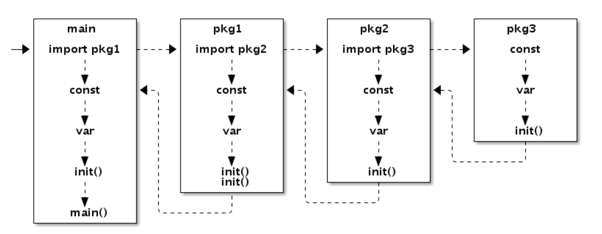

# 语言基础

## 数组

- **定义**

  - ```go
    // 定义长度为3的int型数组, 元素全部为0
    var a [3]int                    
    ```

    > 长度明确指定，元素初始化零值。

  - ```go
    // 定义长度为3的int型数组, 元素为 1, 2, 3
    var b = [...]int{1, 2, 3}
    ```

    > 长度自动计算【初始化元素的数目】
    >
    > 元素初始化：顺序指定全部元素。

  - ```go
    // 定义长度为3的int型数组, 元素为 0, 2, 3
    var c = [...]int{2: 3, 1: 2}
    ```

    > 长度自动计算【出现的最大的索引 + 1】。
    >
    > 元素初始化：索引方式，没有明确初始化的为零值。

  - ```go
    // 定义长度为6的int型数组, 元素为 1, 2, 0, 0, 5, 6
    var d = [...]int{1, 2, 4: 5, 6}
    ```

    > 长度自动计算【出现的最大的索引 + 后面的个数 + 1】。
    >
    > 元素初始化：**混合前两种**。

- **值语义**

- **数组指针**：不够灵活【数组长度属于数组类型】，导致**数组长度不同**的**数组指针类型完全不同**。

## 字符串

```go
type StringHeader struct {
  Data uintptr
  Len  int
}
```

> 底层结构在`reflect.StringHeader`中定义。

- **不可改变**：字符串的元素不可修改，是一个只读的字节数组。
- **类型**：长度虽固定，但长度不属于字符串类型。
- **操作**：切片操作访问同一块内存数据。
- **uft-8**：所以源文件都采用UTF8编码【错误编码不向后扩散】。

## 切片

```go
type SliceHeader struct {
  Data uintptr
  Len  int
  Cap  int
}
```

> 底层结构在`reflect.SliceHeader`中定义。

- **定义**

  ```go
  var (
    a []int               // nil切片, 和 nil 相等, 一般用来表示一个不存在的切片
    b = []int{}           // 空切片, 和 nil 不相等, 一般用来表示一个空的集合
    c = []int{1, 2, 3}    // 有3个元素的切片, len和cap都为3
    d = c[:2]             // 有2个元素的切片, len为2, cap为3
    e = c[0:2:cap(c)]     // 有2个元素的切片, len为2, cap为3
    f = c[:0]             // 有0个元素的切片, len为0, cap为3
    g = make([]int, 3)    // 有3个元素的切片, len和cap都为3
    h = make([]int, 2, 3) // 有2个元素的切片, len为2, cap为3
    i = make([]int, 0, 3) // 有0个元素的切片, len为0, cap为3
  )
  ```

- **类型**：长度不属于切片类型。

- **添加切片元素**

  - *尾部追加*

    ```go
    var a []int
    a = append(a, 1)               // 追加1个元素
    a = append(a, 1, 2, 3)         // 追加多个元素, 手写解包方式
    a = append(a, []int{1,2,3}...) // 追加一个切片, 切片需要解包
    ```

  - *开头添加*

    ```go
    var a = []int{1,2,3}
    a = append([]int{0}, a...)        // 在开头添加1个元素
    a = append([]int{-3,-2,-1}, a...) // 在开头添加1个切片
    ```

  - *中间添加*

    - **临时切片**

      ```go
      var a []int
      a = append(a[:i], append([]int{x}, a[i:]...)...)     // 在第i个位置插入x
      a = append(a[:i], append([]int{1,2,3}, a[i:]...)...) // 在第i个位置插入切片
      ```

    - **非临时切片**

      ```go
      a = append(a, x...)       // 为x切片扩展足够的空间
      copy(a[i+len(x):], a[i:]) // a[i:]向后移动len(x)个位置
      copy(a[i:], x)            // 复制新添加的切片
      ```

      > - **不足**：第一句扩展时的元素复制没有必要的。但并**没有专门扩展切片容量**的内置函数。

- **删除切片元素**

  - *尾部删除*

    ```go
    a = []int{1, 2, 3}
    a = a[:len(a)-1]   // 删除尾部1个元素
    a = a[:len(a)-N]   // 删除尾部N个元素
    ```

  - *开头删除*

    - **原地删除**

      ```go
      a = []int{1, 2, 3}
      a = a[1:] // 删除开头1个元素
      a = a[N:] // 删除开头N个元素
      ```

    - **append原地删除**

      ```go
      a = []int{1, 2, 3}
      a = append(a[:0], a[1:]...) // 删除开头1个元素
      a = append(a[:0], a[N:]...) // 删除开头N个元素
      ```

    - **copy原地删除**

      ```go
      a = []int{1, 2, 3}
      a = a[:copy(a, a[1:])] // 删除开头1个元素
      a = a[:copy(a, a[N:])] // 删除开头N个元素
      ```

  - *中间删除*

    ```go
    a = []int{1, 2, 3, ...}
    
    a = append(a[:i], a[i+1:]...) // 删除中间1个元素
    a = append(a[:i], a[i+N:]...) // 删除中间N个元素
    
    a = a[:i+copy(a[i:], a[i+1:])]  // 删除中间1个元素
    a = a[:i+copy(a[i:], a[i+N:])]  // 删除中间N个元素
    ```

### 切片内存技巧

```go
func TrimSpace(s []byte) []byte {
  b := s[:0]
  for _, x := range s {
    if x != ' ' {
      b = append(b, x)
    }
  }
  return b
}
```

- **使用场景**：原地删除切片元素。
- **高效核心**：降低内存分配次数，尽量保证`append`操作不超出`cap`的容量。

### 切片内存泄漏

- **因为一个小的内存引用而导致底层整个数组处于被使用的状态**。

  ```go
  func FindPhoneNumber(filename string) []byte {
    b, _ := ioutil.ReadFile(filename)
    b = regexp.MustCompile("[0-9]+").Find(b)
    return append([]byte{}, b...)
  }
  ```

  > **解决**：将需要的数据复制到一个新的切片。

- **当切片里存放的是指针对象，那么删除末尾的元素后，被删除的元素依然被切片底层数组引用，无法回收**。

  ```go
  var a []*int{ ... }
  a[len(a)-1] = nil // GC回收最后一个元素内存
  a = a[:len(a)-1]  // 从切片删除最后一个元素
  ```

  > **解决**：将要删除的元素置为nil。

### 切片类型强制转换

- **第一种**

  ```go
  var b []int = ((*[1 << 20]int)(unsafe.Pointer(&a[0])))[:len(a):cap(a)]
  ```

  > 1. 将切片数据的开始地址转换为一个较大的数组的指针。
  > 2. 对数组指针对应的数组重新做切片操作。

- **第二种**

  ```go
  var c []int
  aHdr := (*reflect.SliceHeader)(unsafe.Pointer(&a))
  cHdr := (*reflect.SliceHeader)(unsafe.Pointer(&c))
  *cHdr = *aHdr
  ```

  > 1. 取两个不同类型的切片头信息指针【切片头部信息底层都是`reflect.SliceHeader`结构】
  > 2. 通过更新结构体方式来更新切片信息。

## 函数

- **函数类型**

  - *具名函数*：包级的函数，是匿名函数的一种特例。

  - *匿名函数*：没有名字的函数。

  - *闭包函数*：匿名函数引用了外部作用域的变量。

  - *特殊函数*

    - `main.main`

      > 1. 执行前所有代码都运行在同一个goroutine。
      > 2. 如果某个`init`函数内部用go关键字启动了新的goroutine，新的goroutine在进入`main.main`函数之后才可能被执行到。

    - `init`：可定义多个，所以不能被其它函数调用。

- **可变参数**：当可变参数是一个空接口类型时，调用者是否解包可变参数会导致不同的结果。

  ```go
  var a = []interface{}{123, "abc"}
  
  Print(a...) // 123 abc
  Print(a)    // [123 abc]
  
  func Print(a ...interface{}) {
    fmt.Println(a...)
  }
  ```

- **命名返回值**：返回值命名时，可以通过名字修改返回值，也可以通过`defer`语句在`return`语句之后修改返回值。

  ```go
  func Inc() (v int) {
    defer func(){ v++ } ()
    return 42
  }
  ```

- **闭包的外部变量**

  - *问题*：外部变量以引用的方式访问，`defer` 执行时外部变量的值和定义defer时的值不同。
  - *解决方案*
    - 方案一：循环体内部再定义一个局部变量。
    - 方案二：将迭代变量通过闭包函数的参数传入。

- **defer**：`defer`语句会马上对调用参数求值。

- **堆和栈**：go语言弱化堆栈概念。

  ```go
  func f(x int) *int {
    return &x
  }
  ```

  > Go语言的编译器和运行时比我们聪明的多，它会保证指针指向的变量在合适的地方。

  ```go
  func g() int {
    x = new(int)
    return *x
  }
  ```

  > 不要假设变量在内存中的位置是固定不变的，指针随时可能会变化，特别是在你不期望它变化的时候。

## 方法

- 绑定到一个具体类型的特殊函数

- 方法依托于类型，必须在编译时**静态绑定**。

### 接口

1. **延迟绑定**：可以实现类似虚函数的多态功能。

2. **基础类型（非接口类型）**：不支持隐式的转换。

   > int和int64需要显示转换。

3. **对象和接口之间太灵活**：我们需要**人为地限制这种无意之间的适配**。

   1. **常见的做法**：是定义一个特殊方法来区分接口。
   2. **严格一点**：的做法是给接口定义一个私有方法。

# 并发

## 内存模型

### Goroutine和系统线程

- **Goroutine**
  - 轻量级的线程，非系统线程。
  - **动态伸缩栈**：启动【2KB或4KB】，最大【1GB】。
  - **调度时机**：当前Goroutine发生阻塞。
  - **创建**：所在函数返回前创建。

- **系统线程**

  - **栈固定**：一般2MB【默认】。

    > 定值导致：栈需求少浪费、栈需求大溢出。

  - **GOMAXPROCS**：指定系统线程数量，一般=CPU核数。

### 原子操作

- **sync/atomic**：对基本的数值类型、复杂对象的读写提供了原子操作的支持。

  - *基本数值*：`atomic.AddUint64` 等。

  - *复杂对象*

    ```go
    var config atomic.Value // 保存当前配置信息
    // 初始化配置信息
    config.Store(loadConfig())
    ```

- **sync.Mutex**：在保护一个数值型的共享资源时，麻烦且效率低下。

### 顺序一致性

> Go编译器有重新排序，CPU也有乱序执行。

- **同一Goroutine线程**：保证顺序一致性。
- **不同Goroutine线程**：不保证顺序一致性。
- **同步原语**：可使用chan、sync.Mutex等强行同步。

#### 初始化顺序



- **包的`init`**：以文件名的顺序调用。
- **文件的`init`**：出现顺序调用。

#### channel通信

- **无缓存**

  > 开始发送 -> 开始接收 -> 发送完成 -> 接收完成。
  >
  > 开始接收 -> 开始发送 ->  发送完成 -> 接收完成。

  - **发送完成**：在接收完成前。
  - **开始接收**：在发送完成前。

- **有缓存**

  - **第`K`个接收完成**：在第`K+C`个发送完成前。**`C`是Channel的缓存大小。**

## 并发模式

- **并发与并行**：并发不是并行。

  - **并发**：更关注程序设计，并发程序是可以顺行的。在多核CPU上能真正并行。

  - **并行**：更关注程序运行，并行一般是简单的大量重复。

- **安全退出**：通知goroutine停止它正在干的事情。

  ```go
  func worker(wg *sync.WaitGroup, cannel chan bool) {
    defer wg.Done()
  
    for {
      select {
        default:
        fmt.Println("hello")
        case <-cannel:
        return
      }
    }
  }
  
  func main() {
    cancel := make(chan bool)
  
    var wg sync.WaitGroup
    for i := 0; i < 10; i++ {
      wg.Add(1)
      go worker(&wg, cancel)
    }
  
    time.Sleep(time.Second)
    close(cancel)
    wg.Wait()
  }
  ```

- **content**：简化处理单个请求的Goroutine之间与请求域的数据、超时和退出等操作。

  ```go
  func worker(ctx context.Context, wg *sync.WaitGroup) error {
    defer wg.Done()
  
    for {
      select {
        default:
        fmt.Println("hello")
        case <-ctx.Done():
        return ctx.Err()
      }
    }
  }
  ```

### 生产者消费者模型

> **提升整体处理速度**：平衡生产线程和消费线程的工作能力。

```go
// Producer 不停生成 factor 的整数倍序列
func Producer(factor int, out chan<-) {
  for i := 1; ;i++  {
    out <- factor * i
  }
}

// Consumer 消费者，打印序列
func Consumer(in <-chan) {
  for v := range in {
    fmt.Println(v)
  }
}

func main() {
  ch := make(chan int, 64)

  go Producer(3, ch)
  go Producer(5, ch)
  go Consumer(ch)

  // Ctrl+C 退出
  sig := make(chan os.Signal, 1)
  signal.Notify(sig, syscall.SIGINT, syscall.SIGTERM)
  fmt.Printf("quit (%v)\n", <-sig)
}
```

### 发布订阅模型

> pub/sub模型。会使**系统复杂性**随时间的推移而**增长**。

```go
type (
  subscriber chan interface{}         // 订阅者为一个管道
  topicFunc  func(v interface{}) bool // 主题为一个过滤器
)

// 发布者对象
type Publisher struct {
  m           sync.RWMutex             // 读写锁
  buffer      int                      // 订阅队列的缓存大小
  timeout     time.Duration            // 发布超时时间
  subscribers map[subscriber]topicFunc // 订阅者信息
}

// 构建一个发布者对象, 可以设置发布超时时间和缓存队列的长度
func NewPublisher(publishTimeout time.Duration, buffer int) *Publisher {
  return &Publisher{
    buffer:      buffer,
    timeout:     publishTimeout,
    subscribers: make(map[subscriber]topicFunc),
  }
}

// 添加一个新的订阅者，订阅全部主题
func (p *Publisher) Subscribe() chan interface{} {
  return p.SubscribeTopic(nil)
}

// 添加一个新的订阅者，订阅过滤器筛选后的主题
func (p *Publisher) SubscribeTopic(topic topicFunc) chan interface{} {
  ch := make(chan interface{}, p.buffer)
  p.m.Lock()
  p.subscribers[ch] = topic
  p.m.Unlock()
  return ch
}

// 退出订阅
func (p *Publisher) Evict(sub chan interface{}) {
  p.m.Lock()
  defer p.m.Unlock()

  delete(p.subscribers, sub)
  close(sub)
}

// 发布一个主题
func (p *Publisher) Publish(v interface{}) {
  p.m.RLock()
  defer p.m.RUnlock()

  var wg sync.WaitGroup
  for sub, topic := range p.subscribers {
    wg.Add(1)
    go func(sub, topic, v) {
      defer wg.Done()
      p.sendTopic(sub, topic, v)
    } (sub subscriber, topic topicFunc, v interface{});
  }
  wg.Wait()
}

// 关闭发布者对象，同时关闭所有的订阅者管道。
func (p *Publisher) Close() {
  p.m.Lock()
  defer p.m.Unlock()

  for sub := range p.subscribers {
    delete(p.subscribers, sub)
    close(sub)
  }
}

// 发送主题，可以容忍一定的超时
func (p *Publisher) sendTopic(sub subscriber, topic topicFunc, v interface{}) {
  if topic != nil && !topic(v) {
    return
  }

  select {
    case sub <- v:
    break;
    case <-time.After(p.timeout):
    break;
  }
}
```

### 控制并发数

> 需要适当控制并发程度，给其它的【应用|任务】【让出|预留】一定CPU资源，适当缓解电池的压力【降低功耗】。
>
> **缓存管道**：实现最大并发。

```go
var limit = make(chan int, 3)

func main() {
  for _, w := range work {
    go func() {
      limit <- 1
      w()
      <-limit
    }()
  }
  select{}
}
```

### 赢者为王

> **注意**：**缓存数目要够大**，避免**goroutines泄漏**。

```go
unc main() {
  ch := make(chan string, 32)

  go func() {
    ch <- searchByBing("golang")
  }()
  go func() {
    ch <- searchByGoogle("golang")
  }()
  go func() {
    ch <- searchByBaidu("golang")
  }()

  fmt.Println(<-ch)
}
```

### 素数筛【流水线】

```go
// GenerateNatural 返回生成自然数序列的管道: 2, 3, 4, ...
func GenerateNatural() chan int {
  ch := make(chan int)
  go func() {
    for i:= 2; ;i++ {
      ch <- i
    }
  }
  return ch
}

// PrimeFilter 管道过滤器: 删除能被素数整除的数
func PrimeFilter(prime int, in chan int) chan int {
  out := make(chan int)
  go func () {
    for i := range in {
      if i % prime != 0 {
        out <- i
      }
    }
  }
  return out
}

func main() {
  ch := GenerateNatural() // 自然数序列: 2, 3, 4, ...
  for i := 0; i < 100; i++ {
    prime := <-ch // 新出现的素数
    fmt.Printf("%v: %v\n", i+1, prime)
    ch = PrimeFilter(ch, prime) // 基于新素数构造的过滤器
  }
}
```

